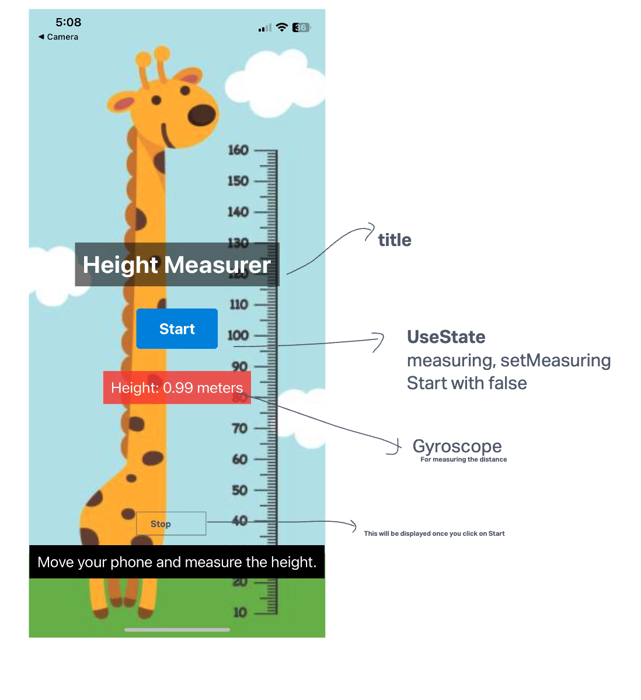

 ## Height Measurer

This react native app is a simple height measurer. It uses accelerometer data to measure the height. 

## How it works

The formula that it uses calculates the time it takes for the phone to fall from the height to the ground. It assumes the phone is in free fall and only under the influence of gravity. 
(But we won't be throwing our phones but instead we will be using it to measure the height of a cupboard or a table or something like that) :smile:

 ## How to use

1. Clone the repo
2. Run npx expo start
3. Scan the QR code with your phone
4. Open the Expo app
5. Press the start button
6. Start measuring the height of the object
7. Press the stop button
8. The height will be displayed on the screen

 
## Styling

The styling is done using react-native-elements like StyleSheet, Text, View, TouchableOpacity, ImageBackground. Accelerometer is used to get the accelerometer data from the phone. 

 ## Screenshots

